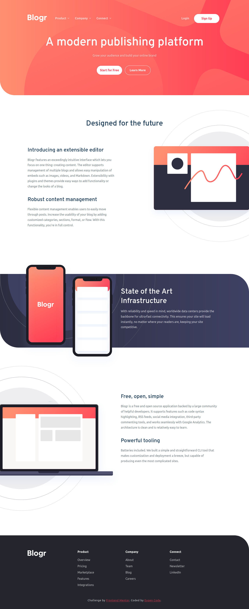
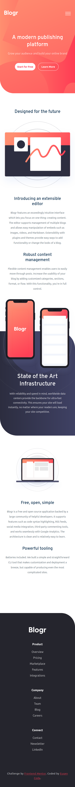
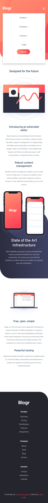

# Frontend Mentor - Blogr landing page solution

This is a solution to the [Blogr landing page challenge on Frontend Mentor](https://www.frontendmentor.io/challenges/blogr-landing-page-EX2RLAApP). Frontend Mentor challenges help you improve your coding skills by building realistic projects.

## Table of contents

- [Overview](#overview)
  - [The challenge](#the-challenge)
  - [Screenshot](#screenshot)
  - [Links](#links)
- [My process](#my-process)
  - [Built with](#built-with)
  - [Useful resources](#useful-resources)
- [Author](#author)

## Overview

### The challenge

Users should be able to:

- View the optimal layout for the site depending on their device's screen size
- See hover states for all interactive elements on the page

### Screenshot

### Links

- Solution URL: [GitHub Repository](https://github.com/EugenCoda/frontend-mentor-blogr-landing-page)
- Live Site URL: [Blogr Landing Page](https://blogr-landing-page-frontend-challenge.netlify.app/)

## My process

### Built with

- Semantic HTML5 markup
- CSS custom properties
- Flexbox
- CSS Grid
- JavaScript

### Useful resources

- [How to change the color of an svg element](https://stackoverflow.com/questions/22252472/how-to-change-the-color-of-an-svg-element) - This was always challenging for me. Here you can find an interesting discussion around the topic.
- [Convert HEX color to CSS filter](https://codepen.io/sosuke/pen/Pjoqqp) - This tool transforms the color to CSS filter property, which you can use to color the svg.

## Author

- Website - [Eugen Coda](https://eugencoda.github.io/)
- Frontend Mentor - [@EugenCoda](https://www.frontendmentor.io/profile/EugenCoda)
- Twitter - [@coda_eugen](https://www.twitter.com/coda_eugen)
